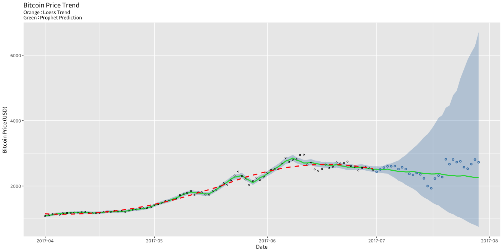

# 실용주의 머신러닝 5주차 : prophet
Minho Lee  
2017 7 30   

# 페이스북 Prophet으로 비트코인 추세 예측하기


```r
library('rvest')
library('lubridate')
library('prophet')
library('tidyverse')
```

## 1. 일별 데이터 가져오기

### 1.1 데이터 크롤링

웹에 올라와있는 비트코인의 일별 가격정보(USD)를 크롤링해서 분석을 진행한다


```r
btc_usd_url = 'https://coinmarketcap.com/currencies/bitcoin/historical-data/?start=20160730&end=20170730'

btc_usd_trend_raw = read_html(btc_usd_url) %>%
  html_node('table') %>% 
  html_table() %>% 
  tbl_df() %>% 
  set_names(c('date', 'open', 'high', 'low', 'close', 'volume', 'market_cap'))

btc_usd_trend_raw
```

```
## # A tibble: 365 x 7
##            date    open    high     low   close        volume
##           <chr>   <dbl>   <dbl>   <dbl>   <dbl>         <chr>
##  1 Jul 29, 2017 2807.02 2808.76 2692.80 2726.45   803,746,000
##  2 Jul 28, 2017 2679.73 2897.45 2679.73 2809.01 1,380,100,000
##  3 Jul 27, 2017 2538.71 2693.32 2529.34 2671.78   789,104,000
##  4 Jul 26, 2017 2577.77 2610.76 2450.80 2529.45   937,404,000
##  5 Jul 25, 2017 2757.50 2768.08 2480.96 2576.48 1,460,090,000
##  6 Jul 24, 2017 2732.70 2777.26 2699.19 2754.86   866,474,000
##  7 Jul 23, 2017 2808.10 2832.18 2653.94 2730.40 1,072,840,000
##  8 Jul 22, 2017 2668.63 2862.42 2657.71 2810.12 1,177,130,000
##  9 Jul 21, 2017 2838.41 2838.41 2621.85 2667.76 1,489,450,000
## 10 Jul 20, 2017 2269.89 2900.70 2269.89 2817.60 2,249,260,000
## # ... with 355 more rows, and 1 more variables: market_cap <chr>
```

### 1.2 데이터 전처리

가져온 데이터를 원하는 형태로 전처리한다


```r
btc_usd_trend = btc_usd_trend_raw %>% 
  mutate(date = as_date(parse_date_time(date, 'Om!* d!, Y!')),
         volume = as.numeric(gsub(',', '', volume)),
         market_cap = as.numeric(gsub(',', '', market_cap)))

btc_usd_trend
```

```
## # A tibble: 365 x 7
##          date    open    high     low   close     volume  market_cap
##        <date>   <dbl>   <dbl>   <dbl>   <dbl>      <dbl>       <dbl>
##  1 2017-07-29 2807.02 2808.76 2692.80 2726.45  803746000 46246700000
##  2 2017-07-28 2679.73 2897.45 2679.73 2809.01 1380100000 44144400000
##  3 2017-07-27 2538.71 2693.32 2529.34 2671.78  789104000 41816500000
##  4 2017-07-26 2577.77 2610.76 2450.80 2529.45  937404000 42455000000
##  5 2017-07-25 2757.50 2768.08 2480.96 2576.48 1460090000 45410100000
##  6 2017-07-24 2732.70 2777.26 2699.19 2754.86  866474000 44995600000
##  7 2017-07-23 2808.10 2832.18 2653.94 2730.40 1072840000 46231100000
##  8 2017-07-22 2668.63 2862.42 2657.71 2810.12 1177130000 43929600000
##  9 2017-07-21 2838.41 2838.41 2621.85 2667.76 1489450000 46719000000
## 10 2017-07-20 2269.89 2900.70 2269.89 2817.60 2249260000 37356800000
## # ... with 355 more rows
```

## 2. Prophet 모형에 Fitting 시키기

2017년 4~6월의 비트코인 가격을 바탕으로 7월의 데이터를 예측해서 비교해보자


```r
btc_usd_trend_2017_tr = btc_usd_trend %>% filter(date >= '2017-04-01', date < '2017-07-01')
btc_usd_trend_2017_ts = btc_usd_trend %>% filter(date >= '2017-07-01')

model_btc_usd_trend_2017_tr = btc_usd_trend_2017_tr %>% 
  select(ds = date, y = close) %>% 
  mutate(y = log(y)) %>% 
  prophet(changepoint.prior.scale = 0.7)
```

```
## Warning in set_auto_seasonalities(m): Disabling yearly seasonality. Run
## prophet with `yearly.seasonality=TRUE` to override this.
```

```
## trying deprecated constructor; please alert package maintainer
```

```
## Initial log joint probability = -2.0332
## Optimization terminated normally: 
##   Convergence detected: relative gradient magnitude is below tolerance
```

```r
future_df_2017_tr = make_future_dataframe(model_btc_usd_trend_2017_tr, periods = 29)
future_btc_usd_trend_2017_tr = model_btc_usd_trend_2017_tr %>% 
  predict(future_df_2017_tr) %>% 
  tbl_df()
```

prophet으로 예측한 추세는 녹색선으로 표시되었다. 해당 기간의 실제 가격은 파란색 점으로 찍혀있다.

(붉은색 점선으로 그려진 선은 training set 기간의 추세선을 LOESS 곡선으로 나타낸 것이다)


```r
future_btc_usd_trend_2017_tr %>% 
  full_join(model_btc_usd_trend_2017_tr %>% 
              `$`('history') %>% 
              select(ds, y), 
            by = 'ds') %>% 
  mutate_at(vars(starts_with('y')), funs(exp)) %>% 
  ggplot(aes(x = ds, y = yhat)) +
    geom_line(color = 'green', size = 1) +
    geom_ribbon(aes(ymin = yhat_lower, ymax = yhat_upper),
                alpha = 0.3, fill = 'steelblue') +
    geom_point(aes(y = y), 
               na.rm = TRUE, size = 1, shape = 21) +
    geom_point(data = btc_usd_trend_2017_ts, aes(x = date, y = close), 
               color = 'steelblue', size = 1, stroke = 1, shape = 21) +
    geom_smooth(aes(y = y), na.rm = TRUE, 
                color = 'red', linetype = 2, size = 1, se = FALSE) +
    ggtitle('Bitcoin Price Trend', 
            subtitle = 'Orange : Loess Trend\nGreen : Prophet Prediction') +
    xlab('Date') + ylab('Bitcoin Price (USD)') +
    scale_x_date(date_labels = '%Y-%m') +
    theme_gray(base_family = 'Kakao')
```

```
## `geom_smooth()` using method = 'loess'
```

<!-- -->

